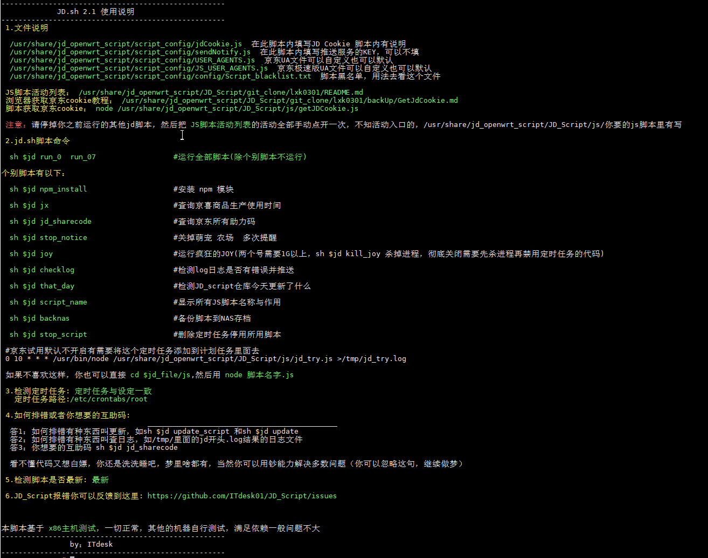

# JD_Script

## 通知

      由于之前的安装方式比较麻烦，现在统一用安装方法1的插件安装方法，本地安装方式可能以后不考虑支持了
**吹水群** :**667491026** (公子大爷请绕道，白嫖可能没人理)

**OP打到阳光通知频道** https://t.me/openwrtscript
   
       
**OP打到阳光吹水群** https://t.me/jdopenwrt

## 序言
   调用https://gitee.com/lxk0301/jd_scripts/blob/master/ 库的JS脚本，进行测试学习，在X86机器使用正常，其他机器满足依赖应该问题不大,
   感谢作者lxk0301 shylocks大佬和其他大佬的JS脚本，谢谢你们的付出
   
   **lxk0301大佬的JS脚本里面的助力码替换成我的了，默认会给我助力，如果你不需要自行删除代码或者禁用他**
  
   ！！！请不要拿去骗小白贩卖，我知道你看的到，你拿去卖，我直接删库，随便给你个大礼。。
   
   觉得好用请点个⭐鼓励一下下~

## 支持系统
openwrt X86 （基于x86编写）

竟斗云路由器（群友极地阳光测试）

N1（群友极地阳光测试）

NANOPI R4S (群友snow测试)

**注意1（设备Rom小于128M别折腾了，你装不下依赖，不用往下看了，RAM最好大点1G左右，512M也行就是不能跑太多账号，不然会死机）**

**注意2（linux底子太薄的，建议好好学习一下，这不是无脑脚本，最起码你要看懂底下操作是做啥的）**

## Usage 使用方法
**1.openwrt需要的依赖(重要，不好好看，报错自行处理)**
 
         git
 
         git-http
 
         node 大于10
 
         node-npm 大于10
         
         openssh-client
         
         openssh-keygen

         python3
 

## 安装办法（插件安装）

**插件地址**
        
        https://github.com/ITdesk01/jd_openwrt_script
      
安装插件好处，会帮你安装好依赖和npm模块，升级openwrt系统配置不会丢失，无需再重新设置，备份路由器数据的时候也会一起打包走，首次开机联网要等5分钟左右（视cpu与网络速度，进程可以看系统日志）

不会编译的可以采用我的编译辅助脚本编译： https://github.com/openwrtcompileshell/OpenwrtCompileScript （编译出来就是带插件的）

## 使用说明文档!!!

[Explain.md](Explain.md)

## 特别声明:

* 本仓库发布的JD_Script项目中涉及的任何脚本，仅用于测试和学习研究，禁止用于商业用途，不能保证其合法性，准确性，完整性和有效性，请根据情况自行判断.

* 本项目内所有资源文件，禁止任何公众号、自媒体进行任何形式的转载、发布。

* ITdesk01对任何脚本问题概不负责，包括但不限于由任何脚本错误导致的任何损失或损害.

* 间接使用脚本的任何用户，包括但不限于建立VPS或在某些行为违反国家/地区法律或相关法规的情况下进行传播, ITdesk01对于由此引起的任何隐私泄漏或其他后果概不负责.

* 请勿将JD_Script项目的任何内容用于商业或非法目的，否则后果自负.

* 如果任何单位或个人认为该项目的脚本可能涉嫌侵犯其权利，则应及时通知并提供身份证明，所有权证明，我们将在收到认证文件后删除相关脚本.

* 任何以任何方式查看此项目的人或直接或间接使用该JD_Script项目的任何脚本的使用者都应仔细阅读此声明。ITdesk01保留随时更改或补充此免责声明的权利。一旦使用并复制了任何相关脚本或JD_Script项目的规则，则视为您已接受此免责声明.

 **您必须在下载后的24小时内从计算机或手机中完全删除以上内容.**   
> ***您使用或者复制了本仓库且本人制作的任何脚本，则视为`已接受`此声明，请仔细阅读***
